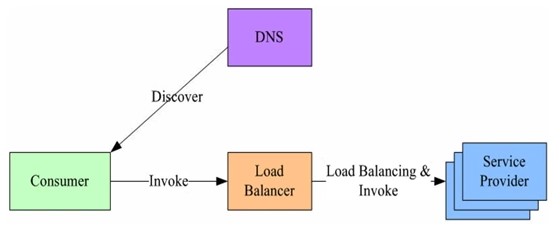

# 1. Etcd的简介

## 1.1 什么是Etcd

etcd是CoreOS团队于2013年6月发起的开源项目，它的目标是构建一个高可用的分布式键值(key-value)数据库。etcd内部采用`raft`协议作为一致性算法，etcd基于Go语言实现。

## 1.2 Etcd的特点

- 简单：安装配置简单，而且提供了HTTP API进行交互，使用也很简单
- 安全：支持SSL证书验证
- 快速：根据官方提供的benchmark数据，单实例支持每秒2k+读操作
- 可靠：采用raft算法，实现分布式系统数据的可用性和一致性

## 1.3 Etcd的应用场景

TODO

# 2. Etcd的安装

Etcd的安装可参考[github](https://github.com/etcd-io/etcd/releases/)

## 2.1 安装在Linux虚拟机

**安装etcd**：

```shell
ETCD_VER=v3.5.4

# choose either URL
GOOGLE_URL=https://storage.googleapis.com/etcd
GITHUB_URL=https://github.com/etcd-io/etcd/releases/download
DOWNLOAD_URL=${GOOGLE_URL}

rm -f /tmp/etcd-${ETCD_VER}-linux-amd64.tar.gz
rm -rf /tmp/etcd-download-test && mkdir -p /tmp/etcd-download-test

curl -L ${DOWNLOAD_URL}/${ETCD_VER}/etcd-${ETCD_VER}-linux-amd64.tar.gz -o /tmp/etcd-${ETCD_VER}-linux-amd64.tar.gz
tar xzvf /tmp/etcd-${ETCD_VER}-linux-amd64.tar.gz -C /tmp/etcd-download-test --strip-components=1
rm -f /tmp/etcd-${ETCD_VER}-linux-amd64.tar.gz

/tmp/etcd-download-test/etcd --version
/tmp/etcd-download-test/etcdctl version
/tmp/etcd-download-test/etcdutl version
```

**测试etcd**：

```shell
# start a local etcd server
/tmp/etcd-download-test/etcd

# write,read to etcd
/tmp/etcd-download-test/etcdctl --endpoints=localhost:2379 put foo bar
/tmp/etcd-download-test/etcdctl --endpoints=localhost:2379 get foo
```

## 2.2 使用docker安装

**安装etcd**：

```shell
rm -rf /tmp/etcd-data.tmp && mkdir -p /tmp/etcd-data.tmp && \
  docker rmi gcr.io/etcd-development/etcd:v3.5.4 || true && \
  docker run \
  -p 2379:2379 \
  -p 2380:2380 \
  --mount type=bind,source=/tmp/etcd-data.tmp,destination=/etcd-data \
  --name etcd-gcr-v3.5.4 \
  gcr.io/etcd-development/etcd:v3.5.4 \
  /usr/local/bin/etcd \
  --name s1 \
  --data-dir /etcd-data \
  --listen-client-urls http://0.0.0.0:2379 \
  --advertise-client-urls http://0.0.0.0:2379 \
  --listen-peer-urls http://0.0.0.0:2380 \
  --initial-advertise-peer-urls http://0.0.0.0:2380 \
  --initial-cluster s1=http://0.0.0.0:2380 \
  --initial-cluster-token tkn \
  --initial-cluster-state new \
  --log-level info \
  --logger zap \
  --log-outputs stderr
```

**测试etcd**：

```shell
# 进入容器
docker exec -it etcd-gcr-v3.5.4 bash
# 测试
etcd --version
etcdctl version
etcdctl endpoint health
etcdctl put foo bar
etcdctl get foo
etcdutl version
```

# 3. 命令行下使用Etcd

用户可以使用etcd的命令行工具etcdctl与etcd服务端进行交互。默认情况下，etcdctl使用的是v2的API，如果需要使用v3的API，则可以先导入以下环境变量

```shell
$ export ETCDCTL_API=3
```

## 3.1 key的常规操作

### 写入一个key

```shell
# foo为key，far为value
$ etcdctl put foo far
```

### 读取一个key

假设现在etcd中有以下键值对:

```shell
foo = bar
foo1 = bar1
foo2 = bar2
foo3 = bar3
```

可以用以下命令读取一个key

```shell
$ etcdctl get foo
foo
bar
```

如果只想打印value的值，可以加上“--prit-value-only”选项:

```shell
$ etcdctl get foo --print-value-only
bar
```

可以通过以下命令来读取一个范围内的key：

```shell
$ etcdctl get foo foo3
foo
bar
foo1
bar1
foo2
bar2
```

> 注意上述命令的key范围是左闭右开区间 [foo，foo3）

遍历所有以foo为前缀的key，可以利用“--prefix”选项：

```shell
$ etcdctl get --prefix foo
foo
bar
foo1
bar1
foo2
bar2
foo3
bar3
```

如果要限制输出的数量，可以加上“--limit”参数

```shell
$ etcdctl get --prefix --limit=2 foo
foo
bar
foo1
bar1
```

### 读取老版本的key

etcd支持客户端读取老版本的key，原因是有些应用程序将etcd作为一个配置中心来用，有读取之前版本key的需求。例如，一个应用可以利用这个特性回滚到较早的某个版本的配置。因为对key的每次修改都会增加etcd集群全局的版本号（reversion），所以只需要提供指定的版本号就能读取相应版本的key。

加入经过如下操作后获取到的版本信息：

```shell
$ etcdctl put foo bar
$ etcdctl put foo bar_new
$ etcdctl get foo -w=json
{"header":{"cluster_id":14841639068965178418,"member_id":10276657743932975437,"revision":14,"raft_term":2},"kvs":[{"key":"Zm9v","create_revision":13,"mod_revision":14,"version":2,"value":"bmV3X2Jhcg=="}],"count":1}
```

- revision：etcd服务端当前全局数据版本号。对任一key的put或delete操作都会使revision自增1。revision=1是etcd的保留版本号，因此用户的key版本号将从2开始。
- mod_revision：当前key最后一次修改时全局数据版本号revision的值。

```shell
# 获取当前版本
$ etcdctl get foo
foo
new_bar

# 获取旧版本
$ etcdctl get --rev=13 foo
foo
bar
```

###  按key的字段序来读取

当客户端希望读取大于或等于key的字节值时，可以通过"--from-key"来实现，假设已经存在了以下键值对：

```shell
a = 123
b = 456
z = 789
```

以下命令是读取比b大的所有key:

```shell
$  etcdctl get --from-key b
b
456
z
789
```

### 删除key

假设etcd中有如下的键值对：

```shell
foo = bar
foo1 = bar1
foo3 = bar3
zoo = val
zoo1 = val1
zoo2 = val2
a = 123
b = 456
z = 789
```

删除一个key

```shell
$ etcdctl del foo
1 # 表示删除key的个数为1
```

删除一个范围内的key

```shell
$ etcdctl del foo foo9
2
```

删除key的时候返回key和value

```shell
$ etcdctl del --prev-kv zoo
1 # 删除的数量 
zoo # 删除的key
val # key对应的value
```

删除以某个字符串为前缀的key

```shell
$ etcdctl del --prefix zoo
```

删除大于或等于某个字符串的所有key

```shell
$ etcdctl del --from-key b
```

## 3.2 key的历史与watch

etcd具有观察（watch）机制，一旦某个key发生变化，客户端就能感知到变化。对应到etcdctl就是watch子命令，除非该子命令捕获到退出信号量（例如：按Ctrl+C快捷键就能向etcdctl发送强制退出信号量），否则会一直等待而不会退出，子命令具体如下：

```shell
$ etcdctl watch foo
# 在另一个终端执行etcdctl put foo bar后在当前终端会打印以下内容
PUT
foo
bar
```

以上命令演示的是watch一个key，当然也可以watch一个范围内的key：

```shell
$ etcdctl watch foo1 foo9
```

> 注意以上也是左闭右开区间，也就是说不包括foo9

watch以某个字符串为前缀的key时使用以下命令：

```shell
$ etcdctl watch --prefix foo
```

watch子命令还可以支持交互（interactive）模式，使用“-i” 选项可以watch多个key:

```shell
$ etcdctl watch -i 
# 输入多个要watch的key
watch foo
watch zoo
```

### 从某个版本号开始watch

etcd支持客户端能够在任意时刻watch key的变化，假设我们已经成功执行了以下操作：

```shell
$ etcdctl put foo bar # reversion = 2
OK
$ etcdctl put foo1 bar1 # reversion = 3
OK
$ etcdctl put foo bar_new # reversion = 4
OK
$ etcdctl put foo bar1_new # reversion = 5
OK
```

> reversion = 1是etcd保留版本号，所以用户的key版本将从2开始。

从版本号2开始观察foo的所有历史变化：

```shell
$ etcdctl watch --rev=2 foo
PUT 
foo
bar 
PUT
foo
bar_new
```

可以看出，foo这个key在历史上经历了两次更新，分别发生在版本号为2和版本号为4的时候。

watch子命令的"--prev-kv"选项指定返回该key修改前最近一个版本的value，具体子命令如下：

```shell
$ etcdctl watch --prev-kv foo
# 在另一个终端执行etcdctl put bar_latest后当前终端会输出
# 更新前的key和value
PUT 
foo
bar_new
# 更新后的key和value
PUT
foo
bar_latest
```

### 压缩版本

etcd所占的磁盘空间不能无限膨胀，因此需要为etcd配置压缩key版本号来释放磁盘空间：

```shell
# 压缩所有key版本号5之前的所有数据
$ etcdctl compact 5
```

所以当使用以下命令来访问key时会报错

```shell
$ etcdctl get --rev=4 foo
```

> 注意压缩的是所有key的版本号，不是单独某一个key的，所以使用时要当心。

## 3.3 租约

租约是etcd v3 API的特性。客户端可以为key授予一个租约（lease），当一个key绑定一个租约时，它的生命周期便会与该租约的TTL（time-to-live）保持一致。

### 获取租约

```shell
$ etcdctl lease grant 10
lease 694d819f80025a42 granted with TTL(10s) # 694d819f80025a42 为租约的ID
```

### 绑定租约

```shell
# 10秒后再去获取key获取不到
$ etcdctl put --lease=694d819f80025a42 foo bar
```

### 撤销租约

```shell
# 租约撤销后将会删除绑定到上面的所有key
$ etcdctl lease revoke 694d819f80025a42
```

### 续租

```shell
$ etcdctl lease keep-alive 694d819f80025a42
lease 694d819f80025a42 keepalived with TTL(100)
lease 694d819f80025a42 keepalived with TTL(100)
...
```

### 获取租约信息

```shell
root@8f6c112173dd:/# etcdctl lease grant 1000
lease 694d819f80025a50 granted with TTL(1000s)
root@8f6c112173dd:/# etcdctl put zoo1 val1 --lease=694d819f80025a50
OK
root@8f6c112173dd:/# etcdctl put zoo2 val2 --lease=694d819f80025a50
OK
# 返回租约的TTL及剩余时间
root@8f6c112173dd:/# etcdctl lease timetolive 694d819f80025a50
lease 694d819f80025a50 granted with TTL(1000s), remaining(942s)
# --keys能够输出绑定的keys
root@8f6c112173dd:/# etcdctl lease timetolive --keys 694d819f80025a50
lease 694d819f80025a50 granted with TTL(1000s), remaining(918s), attached keys([zoo1 zoo2])
```

# 4. Golang接入Etcd

怎么使用Golang接入Etcd，可以参考golang的[API文档](https://pkg.go.dev/go.etcd.io/etcd/client/v3)

## 4.1 连接Etcd

```go
package main

import (
	"fmt"
	"github.com/coreos/etcd/clientv3"
	"time"
)

func main() {
	var (
		config clientv3.Config
		client *clientv3.Client
		err    error
	)

	// 客户端配置
	config = clientv3.Config{
		Endpoints:   []string{"127.0.0.1:2379"},
		DialTimeout: 5 * time.Second,
	}

	// 建立连接
	if client, err = clientv3.New(config); err != nil {
		fmt.Println(err)
		return
	}

	fmt.Println("连接etcd成功:", client.Endpoints())
}
```

运行结果：

```shell
$ go run main.go
连接etcd成功: [127.0.0.1:2379]
```

## 4.2 读写Etcd

```go
package main

import (
	"context"
	"fmt"
	clientv3 "go.etcd.io/etcd/client/v3"
	"time"
)

func main() {
	var (
		config  clientv3.Config
		client  *clientv3.Client
		err     error
		kv      clientv3.KV
		putResp *clientv3.PutResponse
		getResp *clientv3.GetResponse
	)

	config = clientv3.Config{
		Endpoints:   []string{"127.0.0.1:2379"}, // 集群列表
		DialTimeout: 5 * time.Second,
	}

	// 建立一个客户端
	if client, err = clientv3.New(config); err != nil {
		fmt.Println(err)
		return
	}

	defer client.Close()
	fmt.Println("连接etcd成功:", client.Endpoints())

	// 用于读写etcd的键值对
	kv = clientv3.NewKV(client)
	if putResp, err = kv.Put(context.TODO(), "/cron/jobs/job1", "hello", clientv3.WithPrevKV()); err != nil {
		panic(err)
	}

	if putResp, err = kv.Put(context.TODO(), "/cron/jobs/job1", "bye", clientv3.WithPrevKV()); err != nil {
		panic(err)
	}

	fmt.Println("Revision:", putResp.Header.Revision)
	if putResp.PrevKv != nil { // 打印hello
		fmt.Println("PrevValue:", string(putResp.PrevKv.Value))
	}

    // clientv3.WithCountOnly 会只会返回key的个数Count
	if getResp, err = kv.Get(context.TODO(), "/cron/jobs/job1" /*clientv3.WithCountOnly()*/); err != nil {
		panic(err)
	}

	fmt.Printf("Kvs=%v\nCount=%v\n", getResp.Kvs, getResp.Count)
}
```

运行结果：

```shell
$ go run main.go
连接etcd成功: [127.0.0.1:2379]
Revision: 27
PrevValue: hello
Kvs=[key:"/cron/jobs/job1" create_revision:6 mod_revision:27 version:22 value:"bye" ]
Count=1
```

上面的代码是利用一个KV对象来进行读写，也可以利用client对象来直接操作etcd

```go
_, err = client.Put(ctx, "hello", "world")
resp, err := client.Get(ctx, "hello")
```

## 4.3 根据前缀获取所有Key

```go
package main

import (
	"context"
	"fmt"
	clientv3 "go.etcd.io/etcd/client/v3"
	"time"
)

func main() {
	var (
		config  clientv3.Config
		client  *clientv3.Client
		err     error
		kv      clientv3.KV
		getResp *clientv3.GetResponse
	)

	config = clientv3.Config{
		Endpoints:   []string{"127.0.0.1:2379"}, // 集群列表
		DialTimeout: 5 * time.Second,
	}

	// 建立一个客户端
	if client, err = clientv3.New(config); err != nil {
		fmt.Println(err)
		return
	}

	defer client.Close()
	fmt.Println("连接etcd成功:", client.Endpoints())

	// 用于读写etcd的键值对
	kv = clientv3.NewKV(client)
	if _, err = kv.Put(context.TODO(), "/cron/jobs/job1", "job1", clientv3.WithPrevKV()); err != nil {
		panic(err)
	}

	// 写入另外一个Job
	if _, err = kv.Put(context.TODO(), "/cron/jobs/job2", "job2", clientv3.WithPrevKV()); err != nil {
		panic(err)
	}

	// 读取/cron/jobs/为前缀的所有key
	if getResp, err = kv.Get(context.TODO(), "/cron/jobs/", clientv3.WithPrefix()); err != nil {
		panic(err)
	}

	// 获取成功, 我们遍历所有的kvs
	fmt.Println(getResp.Kvs)
}
```

运行结果：

```shell
$ go run main.go 
连接etcd成功: [127.0.0.1:2379]
[key:"/cron/jobs/job1" create_revision:6 mod_revision:32 version:27 value:"job1"  key:"/cron/jobs/job2" create_revision:33 mod_revision:33 version:1 value:"job2" ]
```

## 4.4 删除键值对

```go
package main

import (
	"context"
	"fmt"
	"go.etcd.io/etcd/api/v3/mvccpb"
	clientv3 "go.etcd.io/etcd/client/v3"
	"time"
)

func main() {
	var (
		config  clientv3.Config
		client  *clientv3.Client
		err     error
		kv      clientv3.KV
		delResp *clientv3.DeleteResponse
		kvpair  *mvccpb.KeyValue
	)

	config = clientv3.Config{
		Endpoints:   []string{"127.0.0.1:2379"}, // 集群列表
		DialTimeout: 5 * time.Second,
	}

	// 建立一个客户端
	if client, err = clientv3.New(config); err != nil {
		fmt.Println(err)
		return
	}

	defer client.Close()
	fmt.Println("连接etcd成功:", client.Endpoints())

	// 用于读写etcd的键值对
	kv = clientv3.NewKV(client)
	if _, err = kv.Put(context.TODO(), "/cron/jobs/job1", "job1"); err != nil {
		panic(err)
	}

	// 删除KV
	if delResp, err = kv.Delete(context.TODO(), "/cron/jobs/job1", clientv3.WithPrevKV()); err != nil {
		panic(err)
		return
	}

	// 被删除之前的value是什么
	if len(delResp.PrevKvs) != 0 {
		for _, kvpair = range delResp.PrevKvs {
			fmt.Println("删除了:", string(kvpair.Key), string(kvpair.Value))
		}
	}
}
```

运行结果:

```shell
$ go run main.go
连接etcd成功: [127.0.0.1:2379]
删除了: /cron/jobs/job1 job1
```

如果需要删除多个key，可以使用`clientv3.WithPrefix()`和`clientv3.WithFromKey()`等选项。

## 4.5 租约机制

```go
package main

import (
	"context"
	"fmt"
	clientv3 "go.etcd.io/etcd/client/v3"
	"time"
)

func main() {
	var (
		config         clientv3.Config
		client         *clientv3.Client
		err            error
		lease          clientv3.Lease
		leaseGrantResp *clientv3.LeaseGrantResponse
		leaseId        clientv3.LeaseID
		putResp        *clientv3.PutResponse
		getResp        *clientv3.GetResponse
		kv             clientv3.KV
	)

	config = clientv3.Config{
		Endpoints:   []string{"127.0.0.1:2379"}, // 集群列表
		DialTimeout: 5 * time.Second,
	}

	// 建立一个客户端
	if client, err = clientv3.New(config); err != nil {
		fmt.Println(err)
		return
	}

	defer client.Close()
	fmt.Println("连接etcd成功:", client.Endpoints())

	// 申请一个lease（租约）
	lease = clientv3.NewLease(client)
	// 申请一个10秒的租约
	if leaseGrantResp, err = lease.Grant(context.TODO(), 10); err != nil {
		fmt.Println(err)
		return
	}
	// 拿到租约的ID
	leaseId = leaseGrantResp.ID

	// 获得kv API子集
	kv = clientv3.NewKV(client)
	// Put一个KV, 让它与租约关联起来, 从而实现10秒后自动过期
	if putResp, err = kv.Put(context.TODO(), "/cron/lock/job1", "", clientv3.WithLease(leaseId)); err != nil {
		fmt.Println(err)
		return
	}

	fmt.Println("写入成功:", putResp.Header.Revision)

	// 定时的看一下key过期了没有
	for {
		if getResp, err = kv.Get(context.TODO(), "/cron/lock/job1"); err != nil {
			fmt.Println(err)
			return
		}
		if getResp.Count == 0 {
			fmt.Println("kv过期了")
			break
		}
		fmt.Println("还没过期:", getResp.Kvs)
		time.Sleep(2 * time.Second)
	}
}
```

运行结果：

```shell
go run main.go 
连接etcd成功: [127.0.0.1:2379]
写入成功: 45
还没过期: [key:"/cron/lock/job1" create_revision:45 mod_revision:45 version:1 lease:4554689140352501053 ]
还没过期: [key:"/cron/lock/job1" create_revision:45 mod_revision:45 version:1 lease:4554689140352501053 ]
还没过期: [key:"/cron/lock/job1" create_revision:45 mod_revision:45 version:1 lease:4554689140352501053 ]
还没过期: [key:"/cron/lock/job1" create_revision:45 mod_revision:45 version:1 lease:4554689140352501053 ]
还没过期: [key:"/cron/lock/job1" create_revision:45 mod_revision:45 version:1 lease:4554689140352501053 ]
还没过期: [key:"/cron/lock/job1" create_revision:45 mod_revision:45 version:1 lease:4554689140352501053 ]
kv过期了
```

将代码修改一下实现续租：

```go
package main

import (
	"context"
	"fmt"
	clientv3 "go.etcd.io/etcd/client/v3"
	"time"
)

func main() {
	var (
		config         clientv3.Config
		client         *clientv3.Client
		err            error
		lease          clientv3.Lease
		leaseGrantResp *clientv3.LeaseGrantResponse
		leaseId        clientv3.LeaseID
		putResp        *clientv3.PutResponse
		getResp        *clientv3.GetResponse
		keepResp       *clientv3.LeaseKeepAliveResponse
		keepRespChan   <-chan *clientv3.LeaseKeepAliveResponse
		kv             clientv3.KV
	)

	config = clientv3.Config{
		Endpoints:   []string{"127.0.0.1:2379"}, // 集群列表
		DialTimeout: 5 * time.Second,
	}

	// 建立一个客户端
	if client, err = clientv3.New(config); err != nil {
		fmt.Println(err)
		return
	}

	defer client.Close()
	fmt.Println("连接etcd成功:", client.Endpoints())

	// 申请一个lease（租约）
	lease = clientv3.NewLease(client)
	// 申请一个10秒的租约
	if leaseGrantResp, err = lease.Grant(context.TODO(), 10); err != nil {
		fmt.Println(err)
		return
	}
	// 拿到租约的ID
	leaseId = leaseGrantResp.ID

	// 5秒后会取消自动续租
	if keepRespChan, err = lease.KeepAlive(context.TODO(), leaseId); err != nil {
		fmt.Println(err)
		return
	}

	// 处理续约应答的协程
	go func() {
		for {
			select {
			case keepResp = <-keepRespChan:
				if keepRespChan == nil {
					fmt.Println("租约已经失效了")
					goto END
				} else { // 每秒会续租一次, 所以就会受到一次应答
					fmt.Println("收到自动续租应答:", keepResp.ID)
				}
			}
		}
	END:
	}()

	// 获得kv API子集
	kv = clientv3.NewKV(client)
	// Put一个KV, 让它与租约关联起来, 从而实现10秒后自动过期
	if putResp, err = kv.Put(context.TODO(), "/cron/lock/job1", "", clientv3.WithLease(leaseId)); err != nil {
		fmt.Println(err)
		return
	}

	fmt.Println("写入成功:", putResp.Header.Revision)

	// 定时的看一下key过期了没有
	for {
		if getResp, err = kv.Get(context.TODO(), "/cron/lock/job1"); err != nil {
			fmt.Println(err)
			return
		}
		if getResp.Count == 0 {
			fmt.Println("kv过期了")
			break
		}
		fmt.Println("还没过期:", getResp.Kvs)
		time.Sleep(2 * time.Second)
	}
}
```

运行结果:

```shell
$ go run main.go
连接etcd成功: [127.0.0.1:2379]
写入成功: 47
收到自动续租应答: 4554689140352501064
还没过期: [key:"/cron/lock/job1" create_revision:47 mod_revision:47 version:1 lease:4554689140352501064 ]
还没过期: [key:"/cron/lock/job1" create_revision:47 mod_revision:47 version:1 lease:4554689140352501064 ]
收到自动续租应答: 4554689140352501064
还没过期: [key:"/cron/lock/job1" create_revision:47 mod_revision:47 version:1 lease:4554689140352501064 ]
还没过期: [key:"/cron/lock/job1" create_revision:47 mod_revision:47 version:1 lease:4554689140352501064 ]
收到自动续租应答: 4554689140352501064
还没过期: [key:"/cron/lock/job1" create_revision:47 mod_revision:47 version:1 lease:4554689140352501064 ]
还没过期: [key:"/cron/lock/job1" create_revision:47 mod_revision:47 version:1 lease:4554689140352501064 ]
...
```

## 4.6 监听机制

```go
package main

import (
	"context"
	"fmt"
	"go.etcd.io/etcd/api/v3/mvccpb"
	clientv3 "go.etcd.io/etcd/client/v3"
	"time"
)

func main() {
	var (
		config             clientv3.Config
		client             *clientv3.Client
		err                error
		kv                 clientv3.KV
		watcher            clientv3.Watcher
		getResp            *clientv3.GetResponse
		watchStartRevision int64
		watchRespChan      <-chan clientv3.WatchResponse
		watchResp          clientv3.WatchResponse
		event              *clientv3.Event
	)

	config = clientv3.Config{
		Endpoints:   []string{"127.0.0.1:2379"}, // 集群列表
		DialTimeout: 5 * time.Second,
	}

	// 建立一个客户端
	if client, err = clientv3.New(config); err != nil {
		fmt.Println(err)
		return
	}

	defer client.Close()
	fmt.Println("连接etcd成功:", client.Endpoints())

	// KV
	kv = clientv3.NewKV(client)

	// 模拟etcd中KV的变化
	go func() {
		for {
			kv.Put(context.TODO(), "/cron/jobs/job7", "i am job7")
			kv.Delete(context.TODO(), "/cron/jobs/job7")
			time.Sleep(1 * time.Second)
		}
	}()

	// 先GET到当前的值，并监听后续变化
	if getResp, err = kv.Get(context.TODO(), "/cron/jobs/job7"); err != nil {
		fmt.Println(err)
		return
	}

	// 现在key是存在的
	if len(getResp.Kvs) != 0 {
		fmt.Println("当前值:", string(getResp.Kvs[0].Value))
	}

	// 当前etcd集群事务ID, 单调递增的
	watchStartRevision = getResp.Header.Revision + 1

	// 创建一个watcher
	watcher = clientv3.NewWatcher(client)

	// 启动监听
	fmt.Println("从该版本向后监听:", watchStartRevision)

	ctx, cancelFunc := context.WithCancel(context.TODO())
	// 5秒后停止
	time.AfterFunc(5*time.Second, func() {
		cancelFunc()
	})

	watchRespChan = watcher.Watch(ctx, "/cron/jobs/job7", clientv3.WithRev(watchStartRevision))

	// 处理kv变化事件
	for watchResp = range watchRespChan {
		for _, event = range watchResp.Events {
			switch event.Type {
			case mvccpb.PUT:
				fmt.Println("修改为:", string(event.Kv.Value), "Revision:", event.Kv.CreateRevision, event.Kv.ModRevision)
			case mvccpb.DELETE:
				fmt.Println("删除了", "Revision:", event.Kv.ModRevision)
			}
		}
	}
}
```

运行结果:

```shell
$ go run main.go 
连接etcd成功: [127.0.0.1:2379]
当前值: i am job7
从该版本向后监听: 50
删除了 Revision: 50
修改为: i am job7 Revision: 51 51
删除了 Revision: 52
修改为: i am job7 Revision: 53 53
删除了 Revision: 54
修改为: i am job7 Revision: 55 55
删除了 Revision: 56
修改为: i am job7 Revision: 57 57
删除了 Revision: 58
```

## 4.7 使用Op对象操作Etcd

```go
package main

import (
	"context"
	"fmt"
	clientv3 "go.etcd.io/etcd/client/v3"
	"time"
)

func main() {
	var (
		config clientv3.Config
		client *clientv3.Client
		err    error
		kv     clientv3.KV
		putOp  clientv3.Op
		getOp  clientv3.Op
		opResp clientv3.OpResponse
	)

	config = clientv3.Config{
		Endpoints:   []string{"127.0.0.1:2379"}, // 集群列表
		DialTimeout: 5 * time.Second,
	}

	// 建立一个客户端
	if client, err = clientv3.New(config); err != nil {
		fmt.Println(err)
		return
	}

	defer client.Close()
	fmt.Println("连接etcd成功:", client.Endpoints())

	kv = clientv3.NewKV(client)

	// 创建Op: operation
	putOp = clientv3.OpPut("/cron/jobs/job8", "123123123")

	// 执行OP
	if opResp, err = kv.Do(context.TODO(), putOp); err != nil {
		fmt.Println(err)
		return
	}

	// kv.Do(op)

	// kv.Put
	// kv.Get
	// kv.Delete

	fmt.Println("写入Revision:", opResp.Put().Header.Revision)

	// 创建Op
	getOp = clientv3.OpGet("/cron/jobs/job8")

	// 执行OP
	if opResp, err = kv.Do(context.TODO(), getOp); err != nil {
		fmt.Println(err)
		return
	}

	// 打印
	fmt.Println("数据Revision:", opResp.Get().Kvs[0].ModRevision) // create rev == mod rev
	fmt.Println("数据value:", string(opResp.Get().Kvs[0].Value))
}
```

运行结果：

```shell
$ go run main.go
连接etcd成功: [127.0.0.1:2379]
写入Revision: 59
数据Revision: 59
数据value: 123123123
```

## 4.8 实现分布式锁

```go
package main

import (
	"context"
	"fmt"
	clientv3 "go.etcd.io/etcd/client/v3"
	"time"
)

func main() {
	var (
		config         clientv3.Config
		client         *clientv3.Client
		err            error
		lease          clientv3.Lease
		leaseGrantResp *clientv3.LeaseGrantResponse
		leaseId        clientv3.LeaseID
		keepRespChan   <-chan *clientv3.LeaseKeepAliveResponse
		keepResp       *clientv3.LeaseKeepAliveResponse
		ctx            context.Context
		cancelFunc     context.CancelFunc
		kv             clientv3.KV
		txn            clientv3.Txn
		txnResp        *clientv3.TxnResponse
	)

	config = clientv3.Config{
		Endpoints:   []string{"127.0.0.1:2379"}, // 集群列表
		DialTimeout: 5 * time.Second,
	}

	// 建立一个客户端
	if client, err = clientv3.New(config); err != nil {
		fmt.Println(err)
		return
	}

	defer client.Close()
	fmt.Println("连接etcd成功:", client.Endpoints())

	// lease实现锁自动过期:
	// op操作
	// txn事务: if else then

	// 1, 上锁 (创建租约, 自动续租, 拿着租约去抢占一个key)
	lease = clientv3.NewLease(client)

	// 申请一个5秒的租约
	if leaseGrantResp, err = lease.Grant(context.TODO(), 5); err != nil {
		fmt.Println(err)
		return
	}

	// 拿到租约的ID
	leaseId = leaseGrantResp.ID

	// 准备一个用于取消自动续租的context
	ctx, cancelFunc = context.WithCancel(context.TODO())

	// 确保函数退出后, 自动续租会停止
	defer cancelFunc()
	defer lease.Revoke(context.TODO(), leaseId)

	// 5秒后会取消自动续租
	if keepRespChan, err = lease.KeepAlive(ctx, leaseId); err != nil {
		fmt.Println(err)
		return
	}

	// 处理续约应答的协程
	go func() {
		for {
			select {
			case keepResp = <-keepRespChan:
				if keepRespChan == nil {
					fmt.Println("租约已经失效了")
					goto END
				} else { // 每秒会续租一次, 所以就会受到一次应答
					fmt.Println("收到自动续租应答:", keepResp.ID)
				}
			}
		}
	END:
	}()

	//  if 不存在key， then 设置它, else 抢锁失败
	kv = clientv3.NewKV(client)

	// 创建事务
	txn = kv.Txn(context.TODO())

	// 定义事务

	// 如果key不存在
	txn.If(clientv3.Compare(clientv3.CreateRevision("/cron/lock/job9"), "=", 0)).
		Then(clientv3.OpPut("/cron/lock/job9", "xxx", clientv3.WithLease(leaseId))).
		Else(clientv3.OpGet("/cron/lock/job9")) // 否则抢锁失败

	// 提交事务
	if txnResp, err = txn.Commit(); err != nil {
		fmt.Println(err)
		return 
	}

	// 判断是否抢到了锁
	if !txnResp.Succeeded {
		fmt.Println("锁被占用:", string(txnResp.Responses[0].GetResponseRange().Kvs[0].Value))
		return
	}

	// 2, 处理业务

	fmt.Println("处理任务")
	time.Sleep(5 * time.Second)

	// 3, 释放锁(取消自动续租, 释放租约)
	// defer 会把租约释放掉, 关联的KV就被删除了
}
```

运行结果：

```shell
$ go run main.go
连接etcd成功: [127.0.0.1:2379]
收到自动续租应答: 4554689140352501107
处理任务
收到自动续租应答: 4554689140352501107
收到自动续租应答: 4554689140352501107
```

# 5. Etcd作为注册中心

## 5.1 服务发现介绍

服务发现要解决的也是分布式系统中最常见的问题之一，即在同一个分布式集群中的进程或服务，要如何才能找到对方并建立连接。本质上来说，服务发现就是想要了解集群中是否有进程在监听 udp 或 tcp 端口，并且通过名字就可以查找和连接。

服务发现需要实现一下基本功能：

- `服务注册`：同一service的所有节点注册到相同目录下，节点启动后将自己的信息注册到所属服务的目录中。
- `健康检查`：服务节点定时进行健康检查。注册到服务目录中的信息设置一个较短的TTL，运行正常的服务节点每隔一段时间会去更新信息的TTL ，从而达到健康检查效果。
- `服务发现`：通过服务节点能查询到服务提供外部访问的 IP 和端口号。比如网关代理服务时能够及时的发现服务中新增节点、丢弃不可用的服务节点。

## 5.2 服务注册及健康检查

根据etcd的`v3 API`，当启动一个服务时候，我们把服务的地址写进etcd，注册服务。同时绑定租约（lease），并以续租约（keep leases alive）的方式检测服务是否正常运行，从而实现健康检查。

```go
package main

import (
	"context"
	"log"
	"time"

	clientv3 "go.etcd.io/etcd/client/v3"
)

//ServiceRegister 创建租约注册服务
type ServiceRegister struct {
	cli     *clientv3.Client //etcd client
	leaseID clientv3.LeaseID //租约ID
	//租约keepalieve相应chan
	keepAliveChan <-chan *clientv3.LeaseKeepAliveResponse
	key           string //key
	val           string //value
}

//NewServiceRegister 新建注册服务
func NewServiceRegister(endpoints []string, key, val string, lease int64) (*ServiceRegister, error) {
	cli, err := clientv3.New(clientv3.Config{
		Endpoints:   endpoints,
		DialTimeout: 5 * time.Second,
	})
	if err != nil {
		log.Fatal(err)
	}

	ser := &ServiceRegister{
		cli: cli,
		key: key,
		val: val,
	}

	//申请租约设置时间keepalive
	if err := ser.putKeyWithLease(lease); err != nil {
		return nil, err
	}

	return ser, nil
}

//设置租约
func (s *ServiceRegister) putKeyWithLease(lease int64) error {
	//设置租约时间
	resp, err := s.cli.Grant(context.Background(), lease)
	if err != nil {
		return err
	}
	//注册服务并绑定租约
	_, err = s.cli.Put(context.Background(), s.key, s.val, clientv3.WithLease(resp.ID))
	if err != nil {
		return err
	}
	//设置续租 定期发送需求请求
	leaseRespChan, err := s.cli.KeepAlive(context.Background(), resp.ID)

	if err != nil {
		return err
	}
	s.leaseID = resp.ID
	s.keepAliveChan = leaseRespChan
	log.Printf("Put key:%s  val:%s  success!", s.key, s.val)
	return nil
}

//ListenLeaseRespChan 监听 续租情况
func (s *ServiceRegister) ListenLeaseRespChan() {
	for leaseKeepResp := range s.keepAliveChan {
		log.Println("续约成功", leaseKeepResp)
	}
	log.Println("关闭续租")
}

// Close 注销服务
func (s *ServiceRegister) Close() error {
	//撤销租约
	if _, err := s.cli.Revoke(context.Background(), s.leaseID); err != nil {
		return err
	}
	log.Println("撤销租约")
	return s.cli.Close()
}

func main() {
	var endpoints = []string{"localhost:2379"}
	ser, err := NewServiceRegister(endpoints, "/web/node1", "localhost:8000", 5)
	if err != nil {
		log.Fatalln(err)
	}
	//监听续租相应chan
	go ser.ListenLeaseRespChan()
	select {
	// case <-time.After(20 * time.Second):
	// 	ser.Close()
	}
}
```

主动退出服务时，可以调用Close()方法，撤销租约，从而注销服务。

## 5.3 服务发现

根据etcd的`v3 API`，很容易想到使用`Watch`监视某类服务，通过`Watch`感知服务的`添加`，`修改`或`删除`操作，修改服务列表。

```go
package main

import (
	"context"
	"go.etcd.io/etcd/api/v3/mvccpb"
	"log"
	"sync"
	"time"

	clientv3 "go.etcd.io/etcd/client/v3"
)

//ServiceDiscovery 服务发现
type ServiceDiscovery struct {
	cli        *clientv3.Client //etcd client
	serverList sync.Map
}

//NewServiceDiscovery  新建发现服务
func NewServiceDiscovery(endpoints []string) *ServiceDiscovery {
	cli, err := clientv3.New(clientv3.Config{
		Endpoints:   endpoints,
		DialTimeout: 5 * time.Second,
	})
	if err != nil {
		log.Fatal(err)
	}

	return &ServiceDiscovery{
		cli: cli,
	}
}

//WatchService 初始化服务列表和监视
func (s *ServiceDiscovery) WatchService(prefix string) error {
	//根据前缀获取现有的key
	resp, err := s.cli.Get(context.Background(), prefix, clientv3.WithPrefix())
	if err != nil {
		return err
	}

	for _, ev := range resp.Kvs {
		s.SetServiceList(string(ev.Key), string(ev.Value))
	}

	//监视前缀，修改变更的server
	go s.watcher(prefix)
	return nil
}

//watcher 监听前缀
func (s *ServiceDiscovery) watcher(prefix string) {
	rch := s.cli.Watch(context.Background(), prefix, clientv3.WithPrefix())
	log.Printf("watching prefix:%s now...", prefix)
	for wresp := range rch {
		for _, ev := range wresp.Events {
			switch ev.Type {
			case mvccpb.PUT: //修改或者新增
				s.SetServiceList(string(ev.Kv.Key), string(ev.Kv.Value))
			case mvccpb.DELETE: //删除
				s.DelServiceList(string(ev.Kv.Key))
			}
		}
	}
}

//SetServiceList 新增服务地址
func (s *ServiceDiscovery) SetServiceList(key, val string) {
	s.serverList.Store(key, val)
	log.Println("put key :", key, "val:", val)
}

//DelServiceList 删除服务地址
func (s *ServiceDiscovery) DelServiceList(key string) {
	s.serverList.Delete(key)
	log.Println("del key:", key)
}

//GetServices 获取服务地址
func (s *ServiceDiscovery) GetServices() []string {
	addrs := make([]string, 0, 10)
	s.serverList.Range(func(k, v interface{}) bool {
		addrs = append(addrs, v.(string))
		return true
	})
	return addrs
}

//Close 关闭服务
func (s *ServiceDiscovery) Close() error {
	return s.cli.Close()
}

func main() {
	var endpoints = []string{"localhost:2379"}
	ser := NewServiceDiscovery(endpoints)
	defer ser.Close()
	ser.WatchService("/web/")
	ser.WatchService("/gRPC/")
	for {
		select {
		case <-time.Tick(10 * time.Second):
			log.Println(ser.GetServices())
		}
	}
}
```

## 5.4 运行结果

```shell
#运行服务发现
$go run discovery.go
watching prefix:/web/ now...
put key : /web/node1 val:localhost:8000
[localhost:8000]

#另一个终端运行服务注册
$go run register.go
Put key:/web/node1 val:localhost:8000 success!
续约成功 cluster_id:14841639068965178418 member_id:10276657743932975437 revision:29 raft_term:7 
续约成功 cluster_id:14841639068965178418 member_id:10276657743932975437 revision:29 raft_term:7 
...
```

# 6. GRPC结合Etcd实现负载均衡

由于 gRPC client 和 server 建立的**长连接**, 因而基于连接的负载均衡没有太大意义, 所以 gRPC 负载均衡是基于每次调用. 也就是你在同一个 client 发的请求也希望它被负载均衡到所有服务端.

gRPC官方文档提供了关于gRPC负载均衡方案[Load Balancing in gRPC](https://github.com/grpc/grpc/blob/master/doc/load-balancing.md)，此方案是为gRPC设计的，下面我们对此进行分析。

## 6.1 负载均衡方法

### 集中式（Proxy Model）



在服务消费者和服务提供者之间有一个独立的负载均衡（LB），通常是专门的硬件设备如 F5，或者基于软件如 LVS，HAproxy等实现。LB上有所有服务的地址映射表，通常由运维配置注册，当服务消费方调用某个目标服务时，它向LB发起请求，由LB以某种策略，比如轮询（Round-Robin）做负载均衡后将请求转发到目标服务。LB一般具备健康检查能力，能自动摘除不健康的服务实例。

该方案主要问题：服务消费方、提供方之间增加了一级，有一定性能开销，请求量大时，效率较低。

> 可能有读者会认为集中式负载均衡存在这样的问题，一旦负载均衡服务挂掉，那整个系统将不能使用。 解决方案：可以对负载均衡服务进行DNS负载均衡，通过对一个域名设置多个IP地址，每次DNS解析时轮询返回负载均衡服务地址，从而实现简单的DNS负载均衡。

### 客户端负载（Balancing-aware Client）


针对第一个方案的不足，此方案将LB的功能集成到服务消费方进程里，也被称为软负载或者客户端负载方案。服务提供方启动时，首先将服务地址注册到服务注册表，同时定期报心跳到服务注册表以表明服务的存活状态，相当于健康检查，服务消费方要访问某个服务时，它通过内置的LB组件向服务注册表查询，同时缓存并定期刷新目标服务地址列表，然后以某种负载均衡策略选择一个目标服务地址，最后向目标服务发起请求。LB和服务发现能力被分散到每一个服务消费者的进程内部，同时服务消费方和服务提供方之间是直接调用，没有额外开销，性能比较好。

该方案主要问题：要用多种语言、多个版本的客户端编写和维护负载均衡策略，使客户端的代码大大复杂化。

### 独立LB服务（External Load Balancing Service）


该方案是针对第二种方案的不足而提出的一种折中方案，原理和第二种方案基本类似。

不同之处是将LB和服务发现功能从进程内移出来，变成主机上的一个独立进程。主机上的一个或者多个服务要访问目标服务时，他们都通过同一主机上的独立LB进程做服务发现和负载均衡。该方案也是一种分布式方案没有单点问题，服务调用方和LB之间是进程内调用性能好，同时该方案还简化了服务调用方，不需要为不同语言开发客户库。

下面将介绍第二种负载均衡方法，客户端负载均衡。

## 6.2 GRPC的客户端负载均衡原理

gRPC 采取的客户端负载均衡, 主要由两个客户端组件来完成:

- 维护目标服务名称和真实地址列表的映射 (resolver)
- 控制该客户端和哪些真实地址建立连接, 该将请求发送给哪个服务实例 (balancer)


这种方式是客户端直接请求服务端, 所以没有额外性能开销. 这种模式客户端**可能**会和多个服务端建立连接，gRPC 的 client connection 背后其实维护了一组 subConnections, 每个 subConnection 会与一个服务端建立连接。

balancer已经提供了简单的负载均衡策略（如：Round Robin），我们只需实现它提供的`Builder`和`Resolver`接口，就能完成gRPC客户端负载均衡。

```go
type Builder interface {
	Build(target Target, cc ClientConn, opts BuildOption) (Resolver, error)
	Scheme() string
}

type Resolver interface {
	ResolveNow(ResolveNowOption)
	Close()
}
```

具体如何自己动手实现基于Etcd实现负载均衡可以参考[gRPC Go 服务发现与负载均衡(更新版)](https://blog.cong.moe/post/2021-03-06-grpc-go-discovery-lb/)

## 6.3 利用go-kit工具包实现

[Go kit](https://github.com/go-kit/kit/tree/master/sd/etcdv3) 是用于在 Go 中构建微服务的编程工具包。为我们解决了分布式系统和应用程序体系结构中的常见问题，因此您可以专注于交付业务价值。

Go kit 中实现了多种注册中心（consul、etcd、zookeeper等）以及两种比较简单的负载均衡算法（轮询和随机），具体使用方法如下：

服务端实现：

```go
package main

import (
	pb "code/etcd-grpclb/proto"
	"context"
	"fmt"
	kitLog "github.com/go-kit/kit/log"
	"github.com/go-kit/kit/sd/etcdv3"
	"google.golang.org/grpc"
	"log"
	"net"
	"os"
	"os/signal"
	"syscall"
	"time"
)

type greeterServer struct {
	pb.UnimplementedGreeterServer
}

func (g *greeterServer) SayHello(ctx context.Context, in *pb.HelloRequest) (*pb.HelloReply, error) {
	log.Printf("SayHello Received: %v", in.GetName())
	return &pb.HelloReply{Message: "Hello " + in.GetName()}, nil
}

func (g *greeterServer) SayBye(ctx context.Context, in *pb.ByeRequest) (*pb.ByeReply, error) {
	log.Printf("SayBye Received: %v", in.GetName())
	return &pb.ByeReply{Message: "Bye " + in.GetName()}, nil
}

func main() {
	// 动态获取可用的port
	port, err := GetFreePort()
	if err != nil {
		panic(err)
	}

	var (
		etcdServer     = "127.0.0.1:2379"                        // etcd服务的IP地址
		prefix         = "/services/hello/"                      // 服务的目录
		serverInstance = fmt.Sprintf("%s:%d", "127.0.0.1", port) // 当前实例Server的地址
		key            = prefix + serverInstance                 // 服务实例注册的路径
		value          = serverInstance
		ctx            = context.Background()
	)

	// etcd连接参数
	option := etcdv3.ClientOptions{
		DialTimeout:   time.Second * 3,
		DialKeepAlive: time.Second * 3,
	}

	//创建连接
	client, err := etcdv3.NewClient(ctx, []string{etcdServer}, option)
	if err != nil {
		panic(err)
	}

	registrar := etcdv3.NewRegistrar(client, etcdv3.Service{Key: key, Value: value}, kitLog.NewNopLogger())
	registrar.Register() // 启动注册服务

	listen, err := net.Listen("tcp", serverInstance)
	if err != nil {
		log.Fatalf("failed to listen: %v", err)
	}
	s := grpc.NewServer()
	pb.RegisterGreeterServer(s, &greeterServer{})
	log.Println("Serving gRPC on " + serverInstance)

	go func() {
		if err := s.Serve(listen); err != nil {
			log.Fatalf("listen: %v\n", err)
		}
	}()

	quit := make(chan os.Signal)
	signal.Notify(quit, syscall.SIGINT, syscall.SIGTERM)
	<-quit
	log.Println("Shutdown Server ...")

	registrar.Deregister() // 反注册服务
}

func GetFreePort() (int, error) {
	addr, err := net.ResolveTCPAddr("tcp", "localhost:0")
	if err != nil {
		return 0, err
	}
	l, err := net.ListenTCP("tcp", addr)
	if err != nil {
		return 0, err
	}
	defer l.Close()
	return l.Addr().(*net.TCPAddr).Port, nil
}
```

客户端实现：

```go
package main

import (
	pb "code/etcd-grpclb/proto"
	"context"
	"fmt"
	"github.com/go-kit/kit/endpoint"
	kitLog "github.com/go-kit/kit/log"
	"github.com/go-kit/kit/sd"
	"github.com/go-kit/kit/sd/etcdv3"
	"github.com/go-kit/kit/sd/lb"
	"google.golang.org/grpc"
	"io"
	"strconv"
	"time"
)

const (
	DefaultName = "casa"
	SayHello    = "SayHello"
	SayByte     = "SayByte"
)

type EndPointRequest struct {
	Method string
	Req    interface{}
}

func main() {

	var (
		etcdServer = "127.0.0.1:2379"   // 注册中心地址
		prefix     = "/services/hello/" // 监听的服务前缀
		ctx        = context.Background()
	)

	// etcd连接参数
	options := etcdv3.ClientOptions{
		DialTimeout:   time.Second * 3,
		DialKeepAlive: time.Second * 3,
	}

	// 连接注册中心
	client, err := etcdv3.NewClient(ctx, []string{etcdServer}, options)
	if err != nil {
		panic(err)
	}

	// 创建实例管理器, 此管理器会Watch监听etc中prefix的目录变化更新缓存的服务实例数据
	logger := kitLog.NewNopLogger()
	instancer, err := etcdv3.NewInstancer(client, prefix, logger)
	if err != nil {
		panic(err)
	}

	// 创建端点管理器， 此管理器根据Factory和监听的到实例创建endPoint并订阅instancer的变化动态更新Factory创建的endPoint
	endpointer := sd.NewEndpointer(instancer, reqFactory, logger) // reqFactory 是自定义的业务处理函数

	// 创建轮询负载均衡器
	balancer := lb.NewRoundRobin(endpointer)

	// 获取Endpoint用来进行grpc调用
	retry := lb.Retry(3, 3*time.Second, balancer)

	// 模拟调用10次SayHello和10次SayByte，这20个请求依次轮询发送到不同的服务端
	for i := 0; i < 10; i++ {
		// 调用SayHello方法
		helloRequest := EndPointRequest{
			Method: SayHello,
			Req:    &pb.HelloRequest{Name: DefaultName + " " + strconv.Itoa(i)},
		}
		rsp, err := retry(ctx, helloRequest)
		if err != nil {
			fmt.Println(err)
			continue
		}
		helloReply, _ := rsp.(*pb.HelloReply)
		fmt.Println("Greeting: ", helloReply.GetMessage())

		// 调用SayByte方法
		byeRequest := EndPointRequest{
			Method: SayByte,
			Req:    &pb.ByeRequest{Name: DefaultName + " " + strconv.Itoa(i)},
		}
		byeRsp, err := retry(ctx, byeRequest)
		if err != nil {
			fmt.Println(err)
			continue
		}
		byeReply, _ := byeRsp.(*pb.ByeReply)
		fmt.Println("Greeting: ", byeReply.GetMessage())

		time.Sleep(time.Second)
	}
}

// 通过传入的实例地址  创建对应的请求endPoint
func reqFactory(instanceAddr string) (endpoint.Endpoint, io.Closer, error) {
	return func(ctx context.Context, request interface{}) (interface{}, error) {
		fmt.Println("请求服务: ", instanceAddr)
		conn, err := grpc.Dial(instanceAddr, grpc.WithInsecure())
		if err != nil {
			return nil, err
		}
		defer conn.Close()

		client := pb.NewGreeterClient(conn)
		ctx, cancel := context.WithTimeout(context.Background(), time.Second*5)
		defer cancel()

		req, _ := request.(EndPointRequest)
		switch req.Method {
		case SayHello:
			helloReq, _ := req.Req.(*pb.HelloRequest)
			return client.SayHello(ctx, helloReq)
		case SayByte:
			byeReq, _ := req.Req.(*pb.ByeRequest)
			return client.SayBye(ctx, byeReq)
		default:
			return nil, fmt.Errorf("unsupport method: %s", req.Method)
		}
	}, nil, nil
}
```

运行结果：

```shell
# 服务端1
$ go run server.go
2022/06/28 17:43:55 Serving gRPC on 127.0.0.1:42388
2022/06/28 17:44:20 SayHello Received: casa 1
2022/06/28 17:44:21 SayBye Received: casa 2
2022/06/28 17:44:23 SayHello Received: casa 4
2022/06/28 17:44:24 SayBye Received: casa 5
2022/06/28 17:44:26 SayHello Received: casa 7
2022/06/28 17:44:27 SayBye Received: casa 8

# 服务端2
$ go run server.go
2022/06/28 17:44:07 Serving gRPC on 127.0.0.1:37287
2022/06/28 17:44:19 SayBye Received: casa 0
2022/06/28 17:44:21 SayHello Received: casa 2
2022/06/28 17:44:22 SayBye Received: casa 3
2022/06/28 17:44:24 SayHello Received: casa 5
2022/06/28 17:44:25 SayBye Received: casa 6
2022/06/28 17:44:27 SayHello Received: casa 8
2022/06/28 17:44:28 SayBye Received: casa 9

# 服务端3
$ go run server.go
2022/06/28 17:44:13 Serving gRPC on 127.0.0.1:35465
2022/06/28 17:44:19 SayHello Received: casa 0
2022/06/28 17:44:20 SayBye Received: casa 1
2022/06/28 17:44:22 SayHello Received: casa 3
2022/06/28 17:44:23 SayBye Received: casa 4
2022/06/28 17:44:25 SayHello Received: casa 6
2022/06/28 17:44:26 SayBye Received: casa 7
2022/06/28 17:44:28 SayHello Received: casa 9

# 客户端
go run client.go 
请求服务:  127.0.0.1:35465
Greeting:  Hello casa 0
请求服务:  127.0.0.1:37287
Greeting:  Bye casa 0
请求服务:  127.0.0.1:42388
Greeting:  Hello casa 1
请求服务:  127.0.0.1:35465
Greeting:  Bye casa 1
请求服务:  127.0.0.1:37287
Greeting:  Hello casa 2
请求服务:  127.0.0.1:42388
Greeting:  Bye casa 2
请求服务:  127.0.0.1:35465
Greeting:  Hello casa 3
请求服务:  127.0.0.1:37287
Greeting:  Bye casa 3
请求服务:  127.0.0.1:42388
Greeting:  Hello casa 4
请求服务:  127.0.0.1:35465
Greeting:  Bye casa 4
请求服务:  127.0.0.1:37287
Greeting:  Hello casa 5
请求服务:  127.0.0.1:42388
Greeting:  Bye casa 5
请求服务:  127.0.0.1:35465
Greeting:  Hello casa 6
请求服务:  127.0.0.1:37287
Greeting:  Bye casa 6
请求服务:  127.0.0.1:42388
Greeting:  Hello casa 7
请求服务:  127.0.0.1:35465
Greeting:  Bye casa 7
请求服务:  127.0.0.1:37287
Greeting:  Hello casa 8
请求服务:  127.0.0.1:42388
Greeting:  Bye casa 8
请求服务:  127.0.0.1:35465
Greeting:  Hello casa 9
请求服务:  127.0.0.1:37287
Greeting:  Bye casa 9
```

可以看到，客户端的每次请求，都能以轮询的方式打到不同的服务端实例上。此外，还可以动态删除或添加一个服务端实例，运行结果都能达到预期。完整源码[参考](./code/etcd-grpclb)

